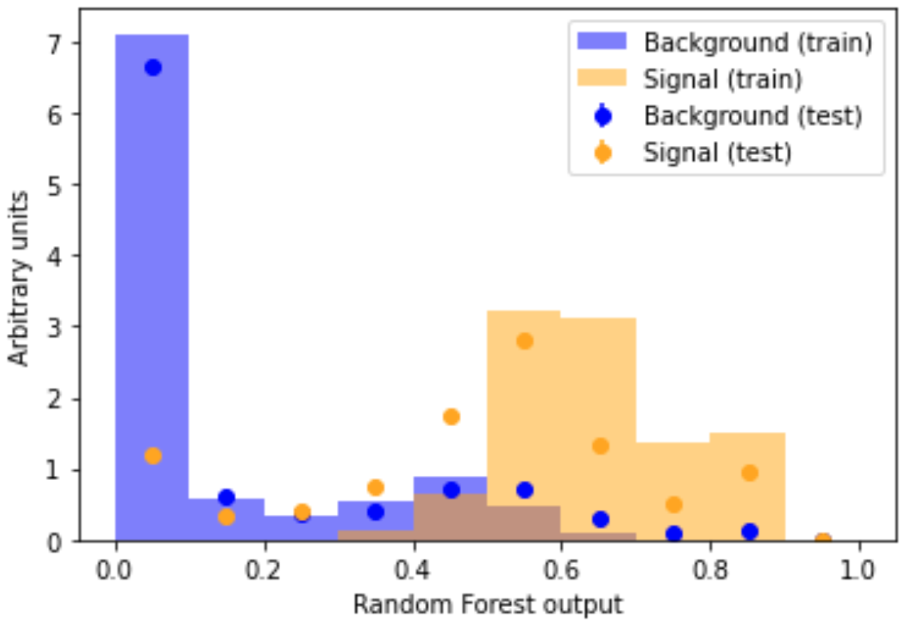

<iframe width="427" height="251" src="https://www.youtube.com/embed?v=GbedkKJiGq4&list=PLKZ9c4ONm-VmHsMKImIDEMsZI1Vp0UY-Z&index=8&ab_channel=HEPSoftwareFoundation" frameborder="0" allow="accelerometer; autoplay; encrypted-media; gyroscope; picture-in-picture" allowfullscreen></iframe>

# Is there any overfitting?

In this section we will check whether there has been any overfitting during the model training phase. As discussed in the [lesson on Mathematical Foundations](https://hsf-training.github.io/hsf-training-ml-webpage/02-mltechnical/index.html), overfitting can be an unwanted fly in the ointment, so it should be avoided!

Comparing a machine learning model's output distribution for the training and testing set is a popular way in High Energy Physics to check for overfitting. The compare_train_test() method will plot the shape of the machine learning model's decision function for each class, as well as overlaying it with the decision function in the training set.

There are techniques to prevent overfitting.

The code to plot the overfitting check is a bit long, so once again you can see the function definition [here](https://www.kaggle.com/meirinevans/my-functions/edit) 

~~~
from my_functions import compare_train_test
compare_train_test(RF_clf, X_train, y_train, X_test, y_test, 'Random Forest output')
~~~
{: .language-python}

If overfitting were present, the dots (test set) would be *very far* from the bars (training set). Look back to the figure in the Overfitting section of the [Mathematical Foundations lesson](https://hsf-training.github.io/hsf-training-ml-webpage/02-mltechnical/index.html) for a brief explanation. Overfitting might look something like this

{:width="120%"}

As discussed in the [Mathematical Foundations lesson](https://hsf-training.github.io/hsf-training-ml-webpage/02-mltechnical/index.html), there are techniques to prevent overfitting. For instance, you could try reduce the number of parameters in your model, e.g. for a neural network reduce the number of neurons. 

Our blue signal dots (test set) nicely overlap with our blue signal histogram bars (training set). The same goes for the red background. This overlap indicates that no overtaining is present. Happy days!

> ## Challenge
> Make the same overfitting check for your neural network and decide whether any overfitting is present.
> 
> > ## Solution
> > ~~~
> > compare_train_test(NN_clf, X_train_nn, y_train_nn, X_test, y_test, 'Neural Network output')
> > ~~~
> > ~~~
> > {: .language-python}
> {: .solution}
{: .challenge}

Now that we've checked for overfitting we can go onto comparing our machine learning models!
